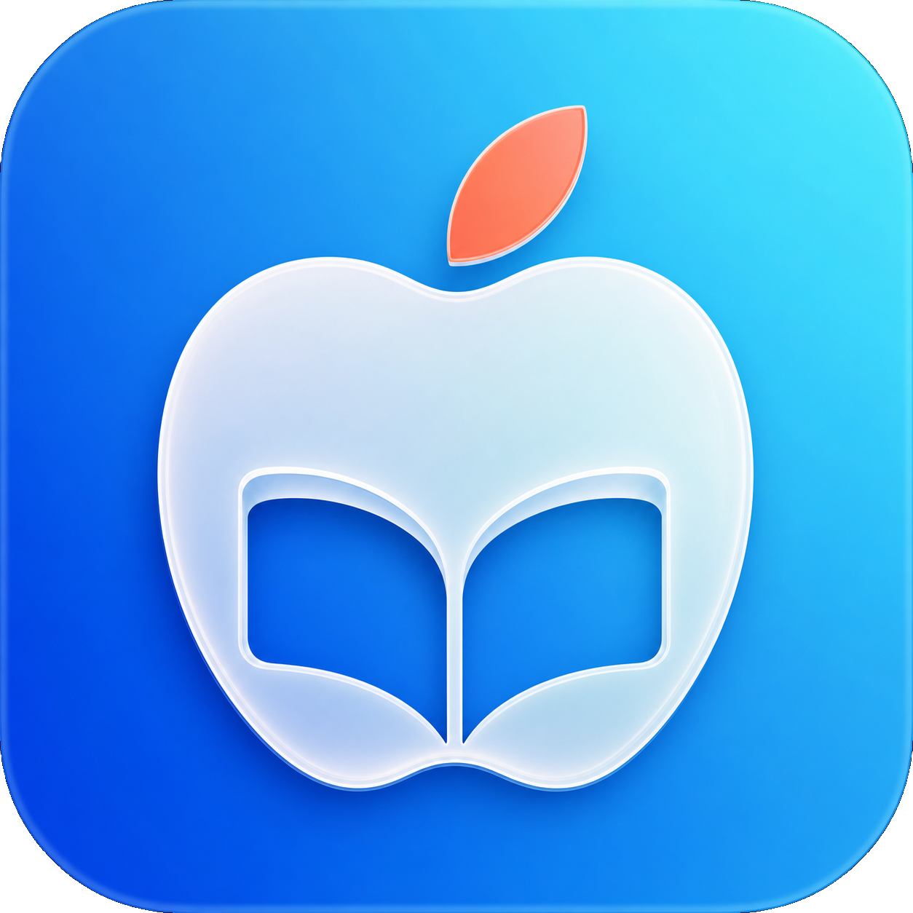

# 来学习

一款原生 macOS 学习规划 App，采用 Liquid Glass 风格，包含今日任务、长期目标、待办、滚动计划表、专注计时、复习提醒和学习数据统计。



## 构建

需要 macOS 13 或更高版本及 Xcode Command Line Tools。

```bash
./build-app.command
open 来学习.app
```

学习数据仅保存在本机的 Application Support 目录，不会提交到仓库。

## 许可证

[MIT](LICENSE)

